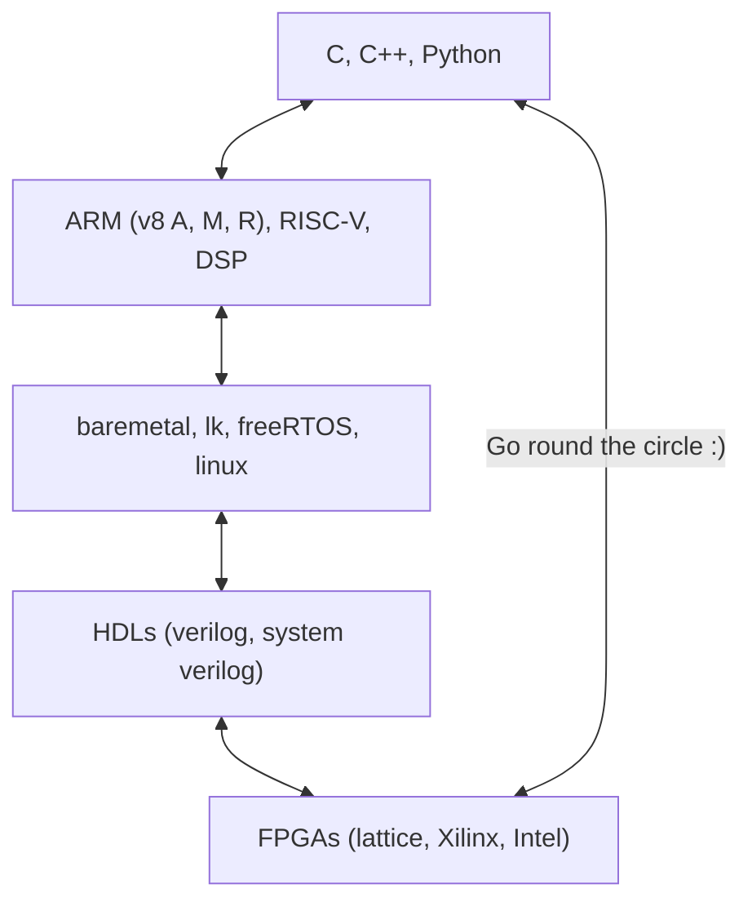

```mermaid
flowchart TD
    languages["C, C++, Python"] <--> cpu["ARM (v8 A, M, R), RISC-V, DSP"]
    cpu <-->os["baremetal, lk, freeRTOS, linux"]
    os <--> hw["HDLs (verilog, system verilog)"]
    hw <--> fpga["FPGAs (lattice, Xilinx, Intel)"]
    fpga <--> |" Go round the circle :) "| languages
```
